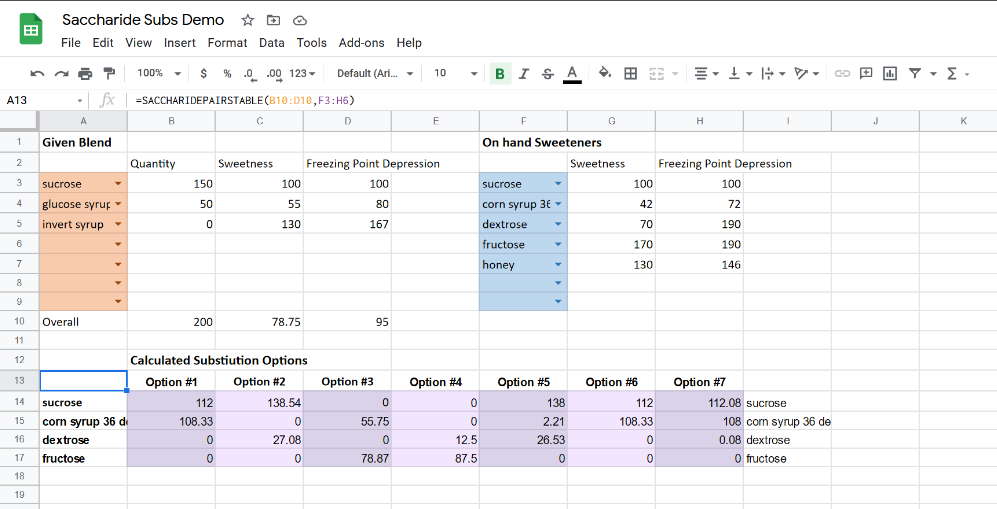

# Saccharide Substitutions

Typescript module to generate possible saccharide substitution combinations for use in ice cream (and any other frozen food) which will have equivalent POD ("Potere Dolcificante") and PAC ("Potere Anticongelante").

### The module can be consumed in one of two ways

1. `yarn install @marcmartino/subs` to utilize the module in code

   - ([Interactive demo on Runkit](https://npm.runkit.com/%40marcmartino%2Fsubs))

   - `calculateSubstitutionOptions`

     ```js
     /**
      * calculates an option that will have the supplied pod and pac given the equations or returns false if no options are found
      *
      * @param {number} totalMass given weight of the original blend
      * @param {number, number[]} pod sweetness goal and linear eq to use as the restraint
      * @param {nubmer, number[]} pac freezing point depression goal and the linear eq to use as a restraint
      * @param {number?} step size of the step length to be used when brute forcing variables
      * @returns {number[] | false} either returns a list of solved values or false
      */
     ```

   - `listPermutations`

     ```js
     /**
      * finds unique combinations of values specific to the busines logic of the sub module
      *
      * @param {number} len number of items that should be combined in the permutation
      * @param {T[]} options list of items to generate permutations from
      * @returns {T[][]} List of groupings
      */
     ```

2. `yarn build:sheets` to generate a standalone js file that can be pasted into the google sheets `Script Editor` to add the custom formula into a spreadsheet

   - ([Interactive sheets demo](https://docs.google.com/spreadsheets/d/1YPnoKZiUxotc0c5Pvlh2w6eQc8SvpK47ZOiENDWlHn8/edit?usp=sharing))

   - `SACCHARIDEPAIRSTABLE`

     ```js
     /**
      *
      * Finds a saccharide substitution with pairs of options
      *
      * @param {Triple<number, number, number>} targets Target qty, pod/sweetness, freezing point depression/pac.
      * @param {subOption[][]} substitution_options list of triples denoting the options suited for substitutions
      * @return {string[]} either a list representing the found substitution, or a single that says no substitutions found
      */
     ```

   - 
